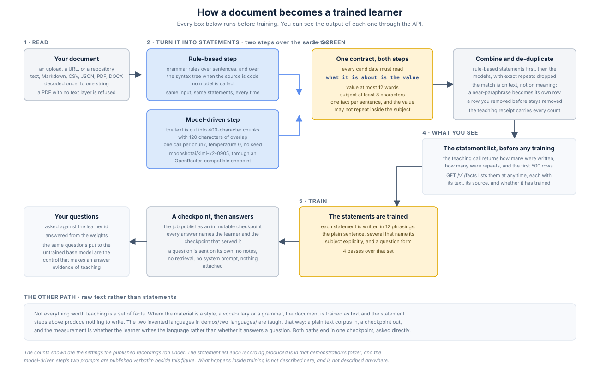

# How a document becomes a trained learner

Every demonstration in this repository starts with a document and ends with a learner answering
questions about it. This page is the step in between, drawn and described, so that a reader
checking a result knows what happened to the material before any training ran.



Two of the boxes are worth naming up front, because they are the ones that change what a learner
ends up holding. The **screen** is a single grammatical contract every candidate statement has to
satisfy, whichever step produced it. The **model-driven step** is a call to a language model, and
it is the one part of this pipeline that does not give the same answer twice.

## 1. Reading the document

A source arrives as an upload, a URL, or a repository. Plain text, Markdown, CSV and JSON are
decoded as UTF-8. PDFs go through a real text-layer extraction, and a PDF with no text layer is
refused rather than turned into an empty document. Word files are read as documents. Older binary
Word files, other archives, and anything that looks like binary are refused with the reason given.

Size ceilings: 8 MiB for an upload, 16 MiB for a URL, 64 MiB for a repository clone.

The decode happens exactly once and everything downstream reads the same string, so the token
count you are quoted, the statements extracted, and the material trained are all the same bytes.

## 2. Turning it into statements

Two steps run over that text, and their outputs are combined.

**The rule-based step** uses grammar rules over sentences, and for a repository, the syntax tree of
each file: which file defines a symbol, what a function's parameters are, what a class inherits
from, what a module-level constant is set to, what a configuration key holds. No model is called
anywhere in it. The same document gives the same statements every time.

**The model-driven step** cuts the text into chunks of about 400 characters with 120 characters of
overlap, and asks a language model to read each chunk and emit one short statement per fact it
finds. The model is `moonshotai/kimi-k2-0905`, called through an OpenRouter-compatible endpoint at
temperature 0 with no seed. There are two prompts, one for prose and one for source code, and both
are published in this folder exactly as they are sent:

- [`prompt-prose.txt`](prompt-prose.txt)
- [`prompt-code.txt`](prompt-code.txt)

Chunk width is a measured setting rather than a guess. Recall of the facts a document contains
rises as the chunks get narrower, from about 45 per cent at 2,400 characters to about 70 per cent
at 400, and then falls again at 250, because below some width a chunk no longer contains the
clause that tells you what a number is about.

A chunk the model fails to answer is retried with backoff, and any chunk still missing at the end
is asked once more on its own. The teaching receipt reports how many chunks were asked and how
many were lost, so a document that was partly not read is visible rather than silent.

## 3. The screen both steps pass

A statement is stored only if it reads as one subject, one linking word, one value:

```
what the fact is about   is   the value
```

`is`, `are`, `was`, `were`, `equals`, `=` and `:` are the linking words, and the split is taken at
the last one that appears. On top of that:

- the value is at most 12 words;
- the part before the linking word is at least 8 characters and has to say what the fact is about;
- the value may not also appear before the linking word;
- one fact per sentence, never two joined by `and`, a comma or a semicolon;
- headings, horizontal rules, single common words and values that are only an abbreviation are
  refused before anything else happens.

A candidate the screen refuses is offered back to the model once, with the passage, the rejected
sentence and the reason. A statement that fails twice is dropped and counted. Every refusal is
counted by reason and the histogram ships on the teaching receipt.

The prompts published above state these rules to the model rather than paraphrasing them, because
a sentence the screen refuses is worth nothing however well written it is.

## 4. Combining, and what counts as a repeat

The rule-based statements go first and the model's are appended. A statement whose text already
exists for that learner is dropped and counted as a repeat. The comparison collapses whitespace and
ignores a trailing full stop, and it folds case for prose while keeping case significant for code,
so `MAX` and `max` stay two facts in a codebase and one fact in an essay.

**The comparison is on text, not on meaning.** A near-paraphrase of a statement already stored is a
new statement, not a repeat. One run of the handbook demonstration stored both `Our flagship
product is Quillstream, a streaming reconciliation engine used by regional utilities.` and `Our
flagship product is Quillstream`, because those are two different strings.

A statement a tenant has removed stays removed: re-teaching the document that produced it does not
bring it back.

## 5. What you see before anything trains

The teaching call returns how many statements were written, how many were repeats, how many were
suppressed, and the first 500 written statements inline. `GET /v1/facts` lists them at any time,
each with its text, the source it came from, and whether it has trained yet. If nothing was
written, the receipt says which of the three reasons it was: nothing was considered, candidates
were found but all refused, or a cap stopped the write.

Every demonstration folder in this repository ships the statement list its run produced, so you can
read the list the recorded learner actually held.

## 6. The write schedule

Each statement is written in **12 phrasings**: the plain sentence, several that name its subject
and its attribute explicitly, and a question form. The schedule makes **4 passes** over that set.

That is the whole of what this page says about training. How a learner stores what it is taught is
not described here and is not described anywhere else.

## The property that has to be disclosed with the pipeline

**The model-driven step is not reproducible.** One unchanged 918-token document was extracted five
times under identical settings, and produced five different sets of statements each time. At
temperature 0, with no seed sent, the call is still not deterministic.

What happens after the statements exist is reproducible: one learner re-quizzed five times returned
the same score every time, and the same row failed each time. The movement belongs to this step
rather than to training or to answering.

The rule-based step is there for the same reason it is slower and narrower: it does give the same
answer twice, and it sets a floor under what a document is guaranteed to yield.

## The other path: training raw text

Not everything worth teaching is a set of facts. Where the material is a style, a vocabulary or a
grammar, the pipeline above produces nothing to write, and the document is trained as text instead.
The two invented languages in [`../demos/two-languages/`](../demos/two-languages/) are taught that
way: a plain corpus goes in, a checkpoint comes out, and what is measured is whether the learner
writes the language, not whether it answers a question.

Both paths end in the same place. One checkpoint, asked directly, with nothing attached to the
question.
