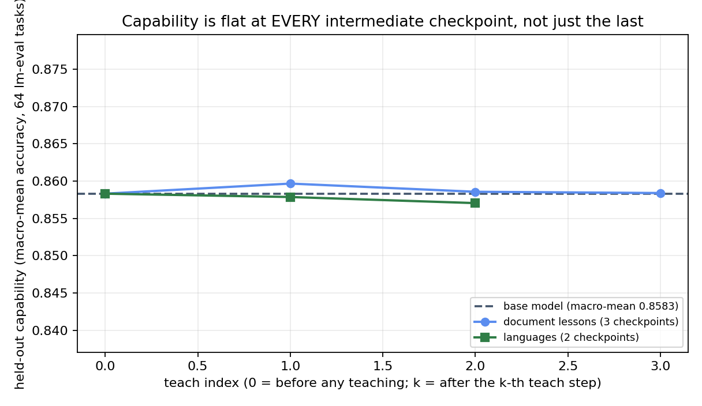

# Capability across every teach step (the trajectory battery)

*Published with the benchmark battery. All numbers and checkpoint ids below are final.*

A single before/after comparison leaves a gap a careful skeptic will name: maybe the model was
fine at the end but degraded in the middle, or maybe the final checkpoint was the one lucky
snapshot. So we measured **every intermediate checkpoint** two of the published learners ever
produced. Each teach step saves an immutable checkpoint, and old checkpoints are retained. On
each one we ran the full held-out likelihood battery (the MMLU suite's 57 subjects,
ARC-Challenge, Winogrande; 16,481 unique scored items per checkpoint, scored as 65 task-metric
rows: the 57 subjects, MMLU's 5 aggregate rollups, ARC under both of its metrics, and
Winogrande).

Each run pins the exact historical checkpoint by its full version id. Inside the run's own
receipt, the evaluation harness records which checkpoint the loader actually resolved and its
content hash; a run only counts when that recorded resolution matches the pin exactly.
The comparison is paired per task-metric row against the untrained base model under identical
settings, same items.

## Result: flat at every step, not just the last one

| Learner | Teach step | Row-mean accuracy | Δ vs base | Task-metric rows outside the noise band |
|---|---|---|---|---|
| — (base) | 0 | 0.8583 | — | — |
| document lessons | after lesson 1 | 0.8588 | +0.0005 | 0 / 65 |
| document lessons | after lesson 2 | 0.8582 | −0.0001 | 0 / 65 |
| document lessons | after a retrain | 0.8605 | +0.0022 | 0 / 65 |
| document lessons | after lesson 3 | 0.8572 | −0.0011 | 0 / 65 |
| two languages | after language 1 | 0.8579 | −0.0004 | 0 / 65 |
| two languages | after language 2 | 0.8570 | −0.0013 | 0 / 65 |

The noise band is a per-row 2σ binomial interval on the base rate; **no row at any checkpoint
moved outside it**. The largest row-mean deviation anywhere on either trajectory is 0.0022.
That is about a fifth of a percentage point, in the direction of *better*. (Scale note:
62 of the 65 rows are MMLU-derived, so the row-mean is MMLU-dominated; the per-row band check,
which covers ARC and Winogrande individually, is the metric that treats every benchmark on its
own terms.)

The claim this table carries: teaching does not trade away general capability at ANY point in a
learner's history. Not "the final model recovered": there was never a dip to recover from.

## The published checkpoint ids

Every checkpoint in the table is loadable by the pinned id below. Pass it as the `model` on
the scoring endpoint (`PROTOCOL.md` has the one-command lm-eval invocation). Each id names ONE
immutable historical checkpoint; the server refuses anything but an exact match, and scoring is
the only thing these ids can do (ask-only, per the verifier contract).

| Teach step | Pinned checkpoint id |
|---|---|
| document lessons, after lesson 1 | `t_be28bc84470f/lrn_ef417f07548b/v2e08cc65cdd8` |
| document lessons, after lesson 2 | `t_be28bc84470f/lrn_ef417f07548b/v754713cb34b8` |
| document lessons, after a retrain | `t_be28bc84470f/lrn_ef417f07548b/v69f2f6d550a4` |
| document lessons, after lesson 3 | `t_be28bc84470f/lrn_ef417f07548b/v7beb50659f0c` |
| two languages, after language 1 | `t_be28bc84470f/lrn_e4559870d51a/v0d4ef433e06a` |
| two languages, after language 2 | `t_be28bc84470f/lrn_e4559870d51a/vc50142900cdf` |

The two battery learners score by their live ids: `lrn_a30df3e1e2b2` (document lessons) and
`lrn_c5020a579689` (two languages); `__base__` is the untrained base model.

## Reproduce it

Every checkpoint in the table remains loadable by its pinned version id through the serving API
(ask-only, per the verifier contract). That is how *you* re-run this table; our own runs above
were executed on evaluation hardware with the same pin-and-verify discipline recorded in each
receipt. The per-item scored rows for every cell are in `answers/` with sha256s; the harness is
stock lm-eval, and the scoring endpoint that lets you drive it against the served checkpoints
is described in `PROTOCOL.md`.
